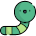

# Crawl 

Crawl is an iOS application with a mission to get and display the 100th character, every 10th character and the count of words from a website.

Open **Crawl.xcworkspace** because I've used [CocoaPods](https://cocoapods.org/).

### Tech
* [Swift](https://swift.org/)
* [SwiftUI](https://developer.apple.com/xcode/swiftui/)
* [Combine](https://developer.apple.com/documentation/combine)
* [SwiftLint](https://github.com/realm/SwiftLint)
* [Quick](https://github.com/Quick/Quick)
* [Nimble](https://github.com/Quick/Nimble)
* [OHHTTPStubs](https://github.com/AliSoftware/OHHTTPStubs)
